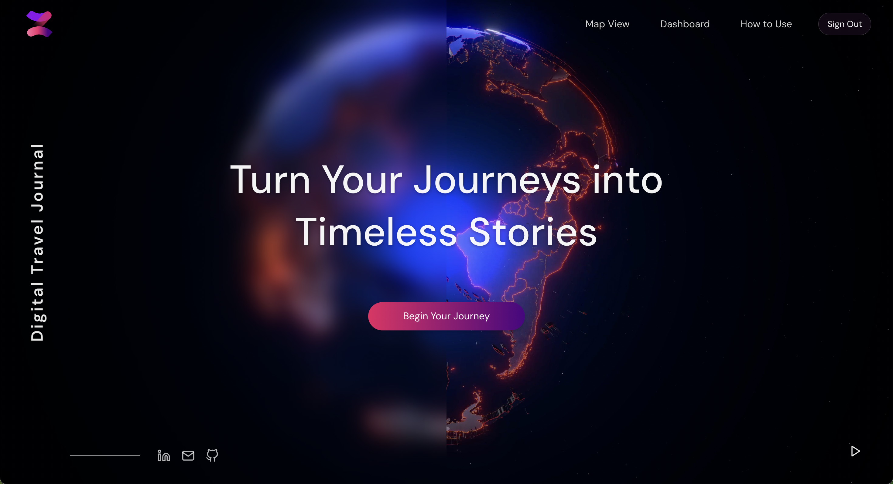
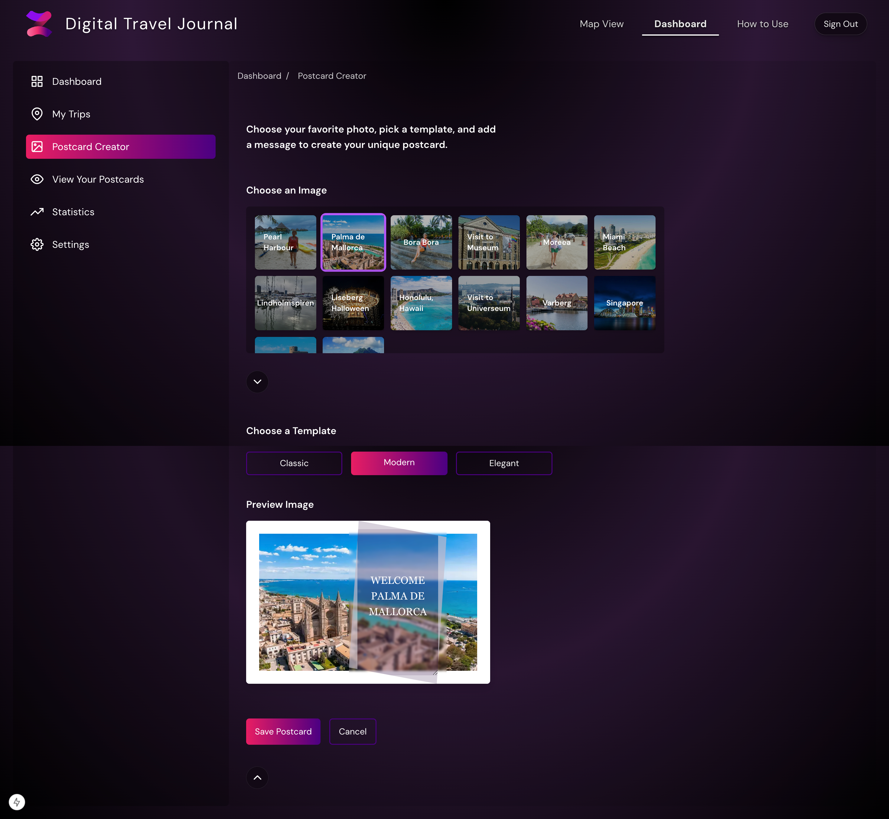

# Digital Travel Journal

Digital Travel Journal is a modern, interactive web application designed with a focus on user experience, performance, and accessibility. Inspired by a passion for travel and personal experiences working on cruise ships, its purpose is to transform travel memories into timeless digital stories.

Users can explore new destinations, document their journeys with interactive maps, and turn cherished moments into beautifully designed, shareable postcards. From interactive maps that let you add locations and track your trips, to a fully customizable postcard creator, the app combines functionality with modern design to make capturing travel experiences fun and meaningful. 

<a href="https://digital-travel-journal-wnb8.vercel.app/" target="_blank">View Live Demo</a>

## Preview

<div align="left">
  
    
</div>
<div align="left">
  
  
</div>

## Features ✨

### Core Functionality

- **Interactive Map Integration**

  - Real-time location tracking
  - Custom marker placement
  - Location search functionality
  - Detailed location information 
  - Trip photo geo-tagging
  - Offline functionality

- **Weather Integration**
  
  - Real-time weather data for selected locations

- **Custom Postcard Creator**

  - Multiple design templates
  - Personal message integration
  - CSS filters for tone adjustments

- **User Experience**
  
  - Secure authentication system (Firebase)
  - Personalized dashboard
  - Smooth animations and transitions

## Technologies

### Frontend
  
- **Next.js 15** - Modern React framework (server-side rendering)
- **TypeScript** - Type safe development
- **Tailwind CSS/SCSS** - For styling and responsivness
- **Framer Motion** - Smooth animations

### Backend && Database
  
- **Firebase**
  - Authentication
  - Firestore Database
  - Storage
    
### APIs

- **Mapbox API** - Interactive map
- **Weather API** - Real-time weather data
- **Unsplash API** - Images
  
### State Management
  
- **Zustand** - Lightweight state management solution

## Tech Stack Motivation

1. **Next.js**: Improved performance compare with other React solutions, including its SSR capabilities and support modern routing and SEO.
2. **TypeScript**: Adds strong typing for fewer bugs and clearer code, scalability.
3. **Firebase**: Quick setup for authentication and database storage.
4. **Mapbox**: Offers interactive map functionalities with great documentation.

## Accessibility

The application follows WCAG 2.1 A and AA standards:

  - Semantic HTML 
  - ARIA labels for accessibility
  - Keyboard navigation 
  - Color contrast for text readability
  - Screen reader compatibility

## Design

The design is inspired by Glassmorphism and modern trends:

 - Clean, dark theme with purple/pink accents
 - Consistent visual hierarchy
 - Responsive layouts for desktop and mobile devices
 - Smooth transitions and engaging UI interactions

## Checklist: Requirements for G & VG   

### Planning & Research
- ✅ Target audience analysis.
- ✅ Github Project link for backlog management.

### Design & Prototyping
- ✅ Wireframes and prototypes in Figma.
- ✅ Responsive design for at least two screen sizes.
- ✅ Adherence to WCAG 2.1 A/AA guidelines.

### Development
- ✅ Built with Next.js 
- ✅ State management with Zustand.
- ✅ Fully functional CRUD operations using Firebase.
- ✅ Firebase Authentication for secure access.
- ✅ Integrated APIs: Mapbox, Unsplash, OpenWeatherMap.

### Accessibility
- ✅ Semantic HTML and ARIA labels.
- ✅ High contrast and screen reader compatibility.

### Deployment & Version Control
- ✅ Hosted on Vercel.
- ✅ GitHub repo with clear commits and feature branches.

### Final 
- ✅ README file including all required sections.
- ✅ Slutrapport 


## Getting Started

### Installation

1. Clone the repository

```bash
git clone https://github.com/CatAvadani/digital-travel-journal.git
```

2. Install dependencies

```bash
npm install
```

3. Configure environment variables
   Create a `.env.local` file:

```env
NEXT_PUBLIC_API_KEY_AUTH=your_api_key
NEXT_PUBLIC_API_KEY_ID=your_api_key
NEXT_PUBLIC_MAPBOX_ACCESS_TOKEN=your_token
NEXT_PUBLIC_UNSPLASH_ACCESS_KEY=your_api_key
NEXT_PUBLIC_API_OPENWEATHERMAP_KEY=your_api_key
```

4. Start development server

```bash
npm run dev
```

## What I Learned

This project gave me valuable hands-on experience with modern web development tools, including: Next.js for building a performant, server-side rendered application,
Firebase for authentication and data storage, Mapbox API for integrating interactive map features, and Zustand for efficient state management.

Additionally, I gained deeper insights into:
 - Applying responsive design principles to ensure a seamless experience across devices.
 - Following WCAG 2.1 accessibility standards to make the app usable for everyone.
 - Managing the entire development lifecycle, from planning and prototyping to deployment.
Beyond technical skills, I learned the importance of adaptability, problem-solving, and attention to detail. This project has strengthened my confidence as a developer and reinforced my belief in continuous growth.


